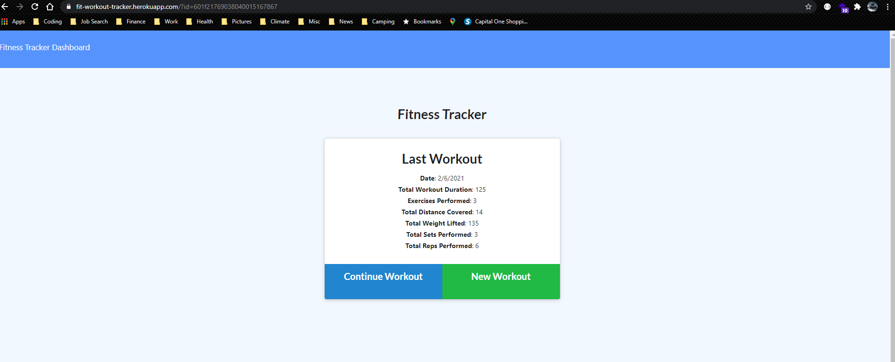
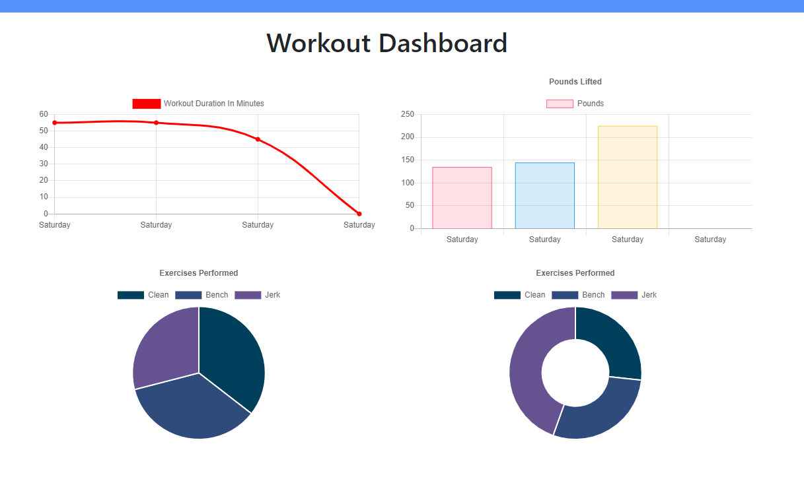

# Project: Portfolio Update

  Deployed Site Link - > https://fit-workout-tracker.herokuapp.com/

## Table of Contents: 
- [Project: Portfolio Update](#project-portfolio-update)
  - [Table of Contents:](#table-of-contents)
  - [License:](#license)
  - [Description:](#description)
  - [Installation Instructions:](#installation-instructions)
  - [Test Command:](#test-command)
  - [Github:](#github)
  - [My Email Address:](#my-email-address)
  - [Other Contributors:](#other-contributors)
  - [Images:](#images)

## License:

## Description:
User Story - As a user, I want to be able to view create and track daily workouts. I want to be able to log multiple exercises in a workout on a given day. I should also be able to track the name, type, weight, sets, reps, and duration of exercise. If the exercise is a cardio exercise, I should be able to track my distance traveled.

In this project we use a MongoDB database with a Mongoose schema and handle routes with Express to provide the user with a functional app.

## Installation Instructions: 
1) npm i 
2) npm run seed

## Test Command: 
N/A

## Github: 
Check out more projects on my Github at https://github.com/ReindeerCode

## My Email Address:
If you have any questions please feel free to email me at ReindeerCode@gmail.com

## Other Contributors:
Collaborated with Eddie (EddiePhi), Dustin (DustinErwin), Aren (arensalmela)

## Images:
Following screen shot is of the Last Workout screen

Following screen shot is of the Dashboard screen

Following screen shot is of the Add Workout screen

